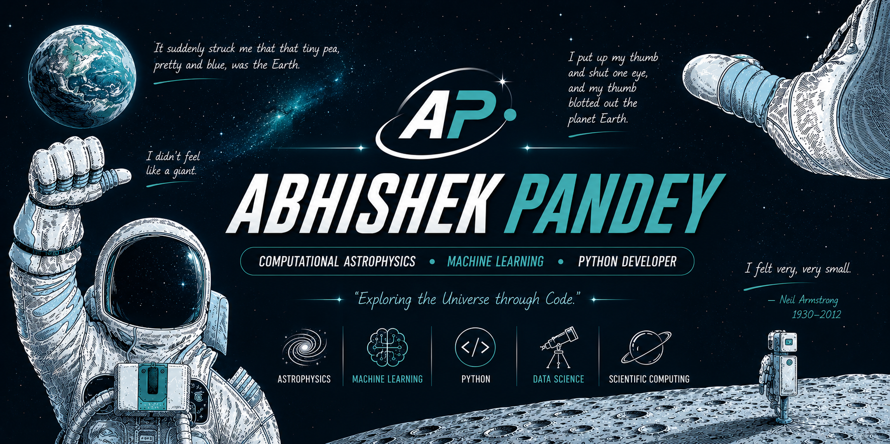

  

<h1 align="center">Hi 👋, I'm Abhishek Pandey</h1>

<h3 align="center">
Computational Astrophysics • Scientific Computing • Machine Learning • Python Developer
</h3>

Building software that explores the universe through computation.

---

# 🚀 About Me

I'm a student passionate about combining **Physics**, **Astronomy**, and **Computer Science** to solve scientific problems.

My primary interests include:

- 🌌 Computational Astrophysics
- 🤖 Machine Learning
- 🛰 Scientific Computing
- 🐍 Python Development
- 🔭 Astronomy Simulations
- 📊 Data Science
- ⚡ Numerical Methods

I enjoy building scientific software, simulations, machine learning models, and developer tools that solve real-world problems.

---

# 🧠 Currently Learning

- Computational Astrophysics
- Numerical Methods
- Deep Learning
- Scientific Python
- High Performance Computing
- Data Structures & Algorithms
- Software Engineering

---

# 🚀 Featured Projects

## 🌌 NovaDesk

Modern desktop productivity suite for developers.

- Project Manager
- Workspace Cleaner
- Downloads Organizer
- Developer Toolkit
- Settings Manager

**Tech**

Python • CustomTkinter

---

## ⭐ Binary Star Simulator

Computational astrophysics project that simulates binary star systems using numerical integration and Newtonian gravity.

**Tech**

Python • NumPy • Physics

---

## 🌌 Galaxy Simulator

N-body gravitational simulation that models galaxy evolution.

**Tech**

Python • Scientific Computing

---

## 🪐 Exoplanet Detection CNN

Deep Learning model for detecting exoplanets using stellar light curves.

**Tech**

Python • PyTorch • Machine Learning

---

## ✨ Astronomy Object Classifier

Machine Learning model that classifies celestial objects using SDSS data.

**Tech**

Python • Scikit-Learn

---

## 🌠 Cosmic OS

A futuristic web operating system inspired by space exploration.

**Tech**

HTML • CSS • JavaScript

---

# 💻 Tech Stack

### Languages

---

### Libraries & Frameworks

---

### Tools

---

# 📊 GitHub Statistics

---

# 🔥 GitHub Streak

---

# 🌍 Research Interests

- Computational Astrophysics
- Stellar Dynamics
- Galaxy Simulations
- Machine Learning for Astronomy
- Scientific Computing
- Numerical Physics

---

# 🎯 2026 Goals

- Build advanced Computational Astrophysics projects
- Contribute to Open Source
- Publish scientific software
- Develop AI for Astronomy
- Learn High Performance Computing
- Strengthen Machine Learning skills

---

# 📫 Connect With Me

GitHub

https://github.com/AP6635514

Portfolio (Coming Soon)

LinkedIn (Coming Soon)

---

"Exploring the Universe through Code."

